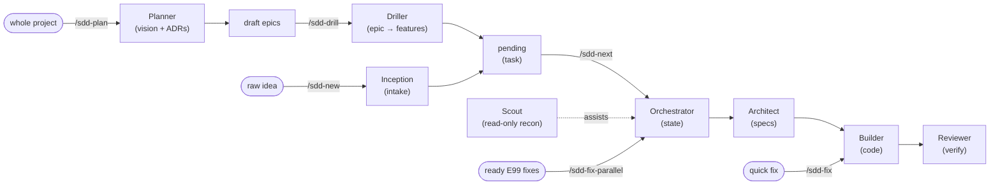

# harness-sdd

A portable **agent harness** for **Spec-Driven Development**. It supports
**Claude Code** (primary), with **Codex** second and **OpenCode** third.
The harness lives in repository files, so the model and supported CLI can change
without moving the project’s intent or history.

> The model is the engine; the harness is the chassis. Start with
> [why the harness exists](docs/RATIONALE.md), then see the compact
> [harness overview](docs/HARNESS.md).

The [0.78.1 baseline](docs/BASELINE-0.78.1.md) preserves the historical five-front-end
inventory and its validation limits. Current releases support three front ends;
Gemini CLI and Antigravity are retired. See [upgrade guidance](docs/INSTALL.md#retiring-gemini-and-antigravity)
for selection migration and preservation of customized legacy files.

## How it works

An interactive **intake** (Inception) turns a raw idea into a seeded `pending` task;
from there the roles move it through files, each in a clean context:



Specs follow a **Product → Epic → Feature** hierarchy, where each feature is a
4-file spec (`.spec` / `.plan` / `.tasks` / `.tests`) with **EARS** acceptance
criteria and full requirement→test **traceability**. When the project has an
architecture (`/sdd-plan`), each feature spec also **cites the architecture decisions
(ADRs) it touches** in a `## Architecture alignment` section. See `docs/SPEC-FORMAT.md`.

Epics carry their own lifecycle — `draft → planned → in-progress → done` (epic-level
`pending` stays valid as a legacy alias of `planned`). A `draft` epic is an inception
sketch: the Orchestrator **never selects features from a `draft` epic**, no matter
what the feature itself says — the foundation for rolling-wave planning (epic
roadmap: `specs/epics/E06-planning-tier/epic.md`). See `docs/WORKFLOW.md`.

The Reviewer runs a **cross-file consistency** check (a change must not contradict the
contracts it invokes) and the build↔review loop is **multi-round until green** — see
`agents/reviewer.md`.

## Quick start in this source checkout (Claude Code)

To use the harness in your own project, follow
[Installing into an existing project](#installing-into-an-existing-project).
The default local TaskStore requires Unix Python 3 with the stdlib `fcntl` module;
no third-party Python packages are required.

```bash
cd harness-sdd
./init.sh                 # environment gate — must pass
claude                    # CLAUDE.md → AGENTS.md auto-loads
# new idea? /sdd-new "<idea>"   # Inception triages it → seeds a pending task
# whole project? /sdd-plan "<idea>"  # the whole-project inception skill: writes vision/architecture + ADRs and seeds draft epics
# deepen one? /sdd-drill <epic-id>  # the per-epic drill-down skill: decomposes a draft epic into features + ADR deltas, then one epic-level approval (draft → planned)
# quick fix? /sdd-fix "<desc>"   # the lightweight fix lane: seeds an sdd:false fix under the reserved maintenance epic (brief only, no spec) and runs Builder → Reviewer
# batch fixes? /sdd-fix-parallel # bounded E99 batch: isolated safe fixes overlap; shared/unknown paths serialize
# then:     /sdd-next            # runs the Orchestrator on the next task
# PR open?  /sdd-pr-loop <pr>    # drives the Codex review cycle: trigger, background watch, classify, fix, merge
```

If `./init.sh` prints a `TaskStore dependency-cycle` warning, follow the closed
feature/slice path to repair `depends_on`; the check is **warn-only** and does not
make a structurally valid board fail. If `/sdd-next` selects nothing, its
`blocked <id> [<reason-code>]` lines explain the relevant dependency, epic,
human-gate, or scoped-owner gate and finish with a `no actionable work` summary.
Diagnostics are read-only and do not change selection policy. See
[Diagnosing blocked selection](docs/WORKFLOW.md#diagnosing-blocked-selection).

`/sdd-next` uses `tools/next-task.mjs` for deterministic, read-only JSON
selection. Missing Node or invalid selector output is reported and falls back to
the preserved Orchestrator prose oracle, so Node is an optional upgrade rather
than an `init.sh` prerequisite. For direct troubleshooting, run
`node tools/next-task.mjs --json` (or
`node .harness/tools/next-task.mjs --json` after installation).

`/sdd-new` is the front door: it asks a few questions, decides whether the idea is a
new epic / feature / task, and writes a `pending` entry plus an intent brief — without
hand-editing `state/tasks.json`. Then the Orchestrator spawns `architect` → (human
approves) → `builder` → `reviewer`.

## Supported CLIs

| CLI | Entry file | Sub-agents |
|---|---|---|
| **Claude Code** | `CLAUDE.md` → `AGENTS.md` | `.claude/agents/*` (+ `pr-fixer`) + `/sdd-new`, `/sdd-plan`, `/sdd-drill`, `/sdd-fix`, `/sdd-fix-parallel`, `/sdd-next`, `/sdd-pr-loop` |
| **Codex** | `AGENTS.md` (native) | `.codex/agents/*.toml` roles + the shared repository-local `$sdd-*` skills in `.agents/skills/` (including gated `$sdd-pr-loop`) |
| **OpenCode** | `AGENTS.md` (native) + `opencode.json` | `opencode.json` agents + `.opencode/command/*`, including `/sdd-test-concurrency` and `/sdd-pr-loop`; it also reads the shared `.agents/skills/` units, so `/sdd-*` resolve from both surfaces; `/sdd-fix-parallel` is opt-in (verified by `/sdd-test-concurrency`) |

The tables and workflow prose use the portable `/sdd-*` spelling; in Codex, invoke the
shared repository skills as `$sdd-next`, `$sdd-new`, `$sdd-plan`, `$sdd-drill`, `$sdd-fix`,
`$sdd-fix-parallel`, and (when enabled) `$sdd-pr-loop`. For example, enter
`$sdd-new Add a settings page`, then `$sdd-next`; accompanying text supplies the
workflow’s `$ARGUMENTS`. OpenCode reads the same shared units, so `/sdd-*` resolve from
`.agents/skills/` as well as from `.opencode/command/`; in Codex, `/skills` is the
discovery UI. The human spec approval gate and independent Reviewer verdict apply in
Codex too.

`/sdd-pr-loop` and front-end-specific `pr-fixer` glue follow the **PR-policy gate**:
they are stamped only while `pr_loop.enabled` is `true` in `harness.config.yaml`.
The gate is **opt-in — a fresh install seeds `false`**. The loop needs the **Codex GitHub App** on the
repo, an **authed `gh`** and **`jq`**; without them `/sdd-pr-loop` could only fail its own
preflight, so nothing is written until you set `pr_loop.enabled: true` and re-run the
installer. An absent block, an absent key or any non-`true` value all mean off.
OpenCode separately gates `/sdd-fix-parallel` on its concurrency capability
marker or an explicit override; the shared `sdd-fix-parallel` skill body carries the
same precondition, so it holds wherever the workflow is invoked in OpenCode. Codex has
seven standard roles and an eighth native `pr-fixer` only while the PR-loop gate is on.
It handles each comment in a fresh role context with file-only handoffs. A host unable
to start that role must report the limitation and handoff path; it cannot claim an
isolated fix ran.

The harness body — `AGENTS.md`, `agents/`, `specs/`, `progress/`, `init.sh`, the
stores — is **identical** across all of them. Only the entry filename and the
sub-agent mechanism differ. Which of these front-ends gets installed is your choice —
the installer lets you select the agents to support and re-prompts on interactive upgrades
(see [Installing into an existing project](#installing-into-an-existing-project)).

## Configuring the knowledge base / state

`harness.config.yaml` picks the store backend (no prompt changes when you swap):

| Backend | Status | Notes |
|---|---|---|
| `local` | ✅ default | `state/tasks.json` + markdown; Unix Python 3 with stdlib `fcntl` |
| `obsidian` | ✅ | point a vault at the repo; frontmatter + `[[wikilinks]]` |
| `jira` | ⏳ stub | contract defined in `store/jira.md`; wire MCP in a follow-up |

A **backend** is *where state lives*. Two optional, **VCS/PM-neutral** seams sit beside it
(both empty/off by default, so nothing changes unless you opt in):

- **`store.on_write_command`** — a command the Orchestrator runs after every persisted
  store write (best-effort, never blocks the loop). Point it at a `git push`, a board
  mirror, or a wrapper doing both. The harness never learns what it does. See
  `store/local.md` → "Post-write sync".
- **Project board mirror** — a one-way projection of `state/tasks.json` onto a Kanban
  board (see below).

## Delegating implementation (execution backend)

By default the **Builder writes code itself**, in whatever CLI you're running — no
extra dependencies, works for everyone. That's `execution.builder.backend: in-session`.

If you have an external executor (a multi-agent orchestrator, a remote build
service, anything that takes a spec and produces an implementation), you can hand
the **Builder phase** off to it without forking any role file:

```yaml
# harness.config.yaml
execution:
  builder:
    backend: delegate
    delegate_cmd: "bash path/to/your-executor.sh"
```

In `delegate` mode the Builder does not write code — it invokes
`delegate_cmd <feature-id> <abs-spec-path>` and surfaces the result. The executor
owns implementation (and may own PR creation / review too). On non-zero exit the
Builder records the failure and hands back to the Orchestrator.

Scope is deliberate and structural:

- **Only the Builder is delegatable.** The Orchestrator is *never* a key here — it
  is the loop that reads this config and calls `delegate_cmd`, so it always runs in
  the host code-agent. Architect / Reviewer / Scout also stay in-session.
- To make a new role delegatable later, add a sibling key (e.g. `architect:`) — the
  Orchestrator can never be one.

This is the seam that lets a heavier orchestrator *consume* the harness while the
harness stays standalone: the harness never learns what the executor is, and a
single-CLI user is unaffected (they keep the `in-session` default). For a worked
example, see the multi-cli-orchestrator project, which wires its CLI-routing +
Codex-PR pipeline in as one such executor.

## Observability (telemetry)

The harness records its own work — per-sub-agent **durations**, build↔review **round
counts**, and **human spec-approval latency** (the gap between `spec-ready` and a human
moving it to `in-progress`) — to a zero-dependency JSONL log, and rolls it up into
reports. It is **on by default** and **best-effort** (a telemetry write never blocks a
gate or build).

```bash
python3 tools/telemetry-report.py            # all-granularity summary
python3 tools/telemetry-report.py weekly      # daily|weekly|monthly|quarterly|semester|annual
python3 tools/telemetry-report.py session     # this session (also printed at session end)
```

The log is **local-only / gitignored** runtime data at `<HARNESS_DIR>/telemetry.jsonl`
(`.harness/telemetry.jsonl` in an installed consumer; the installer seeds a targeted
`.harness/.gitignore`), configurable via the `telemetry:` block (incl. an `enabled`
kill-switch) in `harness.config.yaml`. Token/USD cost is out of scope for the portable
markdown-prompt runtime (a reserved `cost` slot is left for an instrumented SDK runtime).
See `agents/orchestrator.md` → "## Telemetry".

## Project board mirror

Optionally **mirror** `state/tasks.json` onto an external project board so humans get a
Kanban view — one issue/work-item per feature, with Status + Epic fields, closing done /
reopening regressed. It is a **one-way projection**: `tasks.json` stays the source of
truth and the agents never read the board, so unlike a store backend it never has to be
reachable for the loop to run. **Opt-in and inert by default.**

```yaml
# harness.config.yaml
mirror:
  board:
    provider: github-projects   # ""/none (default) · github-projects · jira · azure-boards
    owner: my-org
    project_number: 1
    repo: my-org/specs
```

```bash
node tools/sync-board.mjs            # sync the configured provider
node tools/sync-board.mjs --dry-run  # preview, mutate nothing
```

`github-projects` (needs `gh`) and Jira Server/Data Center (`jira`, REST + Bearer PAT)
are implemented mirrors. `azure-boards` remains a recognized no-op **stub**.
Mirror execution requires Node. Run it automatically after each status change via
`store.on_write_command`. **Mirror ≠ backend**: a mirror projects local truth outward; a
backend (`tasks: jira`) *is* the truth. Full contract, the provider table, and column
configuration: [board mirror contract](store/board-mirror.md).

## Source checkout layout

```
AGENTS.md                    entrypoint (open standard)
CLAUDE.md                    thin Claude pointer
opencode.json                OpenCode agents + AGENTS.md instruction
harness.config.yaml          store backends, hooks, mirror, telemetry, umbrella
harness-install.sh           install/upgrade into a target (+ --umbrella, --shared-repo)
init.sh                      environment verification gate
agents/                      role prompts (canonical)
tools/                       shell, Python and Node utilities (next-task.mjs, telemetry-report.py, sync-board.mjs, wait-for-codex.sh, opencode-model-helper.sh)
specs/                       product.md, glossary.md, _templates/, epics/<E>/<F>/*.md
state/                       tasks.json (local TaskStore)
progress/                    run output + history.md
store/                       tasks.schema.json, store contract + adapters (local, obsidian, jira) + board-mirror
docs/                        [RATIONALE.md](docs/RATIONALE.md), SPEC-FORMAT, WORKFLOW, HARNESS, INSTALL, UMBRELLA, CONFIG-LAYERING
umbrella.manifest.example.yaml   cross-repo coordinator manifest template
umbrella.gitignore.example       shared-spec-repo .gitignore reference
.claude/                     generated Claude Code sub-agents + commands + glue manifest
.codex/agents/               generated native Codex role TOMLs
.agents/skills/              generated explicit Codex workflow skills + policy companions
```

Consumer installs put the body under `.harness/` and generate only selected and
enabled front-end surfaces. Source `./harness-install.sh --self` defaults to
**Claude + Codex**; `--agents=claude` or `--agents=codex` selects one source set.
Source references resolve from the repository root, while consumer glue resolves
from `.harness/`. Existing per-role models survive regeneration. With inherited
Codex models, combined source escalation is **UNARMED** even when Claude alone
was armed; explicit Claude-only generation preserves that prior verdict. See
[self mode and optional models](docs/INSTALL.md#self-mode----self-harness-developers-only).

### Codex PR review loop

`/sdd-pr-loop <pr>` (or `$sdd-pr-loop <pr>` in Codex) drives the Codex review cycle on one open PR: it preflights
`gh`/auth/`jq`/the PR, posts `@codex review`, launches `tools/wait-for-codex.sh` in the
**background** (so a review landing minutes later still wakes the session), classifies
`P0|P1|P2|nit` from the inline findings + review bodies + issue comments, spawns one
`pr-fixer` per blocking comment, and merges when every gate is green and every remaining
unresolved thread is Codex-owned. A non-Codex unresolved thread routes to `needs-human`
and never merges.

Policy lives in `harness.config.yaml` under `pr_loop:` — `enabled` (opt-in master gate,
seeded `false`), `auto_merge`, `max_rounds`, `blocking_severities`, `merge_strategy` —
each overridable
per run by `HARNESS_PR_LOOP_ENABLED`, `HARNESS_AUTO_MERGE`, `HARNESS_MAX_ROUNDS`,
`HARNESS_BLOCKING_SEVERITIES`, `HARNESS_MERGE_STRATEGY`. Execution knobs are env-only:
`HARNESS_POLL_INTERVAL` (60s), `HARNESS_POLL_CEILING` (900s), `HARNESS_FIRST_RESPONSE`
(180s — fail fast when the Codex GitHub App never answers) and `HARNESS_DRY_RUN`.
`gh` and `jq` are required only by this loop; `init.sh` does not check for them.

### Parallel maintenance fixes

`/sdd-fix-parallel` consumes a deterministic bounded batch of ready autonomous
`sdd:false` fixes already seeded under E99. `fix_lane.max_parallel` defaults to `3`.
The built-in guard always serializes fixes naming `harness-install.sh`,
`tests/test_install.sh`, or `tools/*`; `fix_lane.shared_paths` can only extend that
list. Missing or unsafe expected-path metadata is guarded. Parallel-safe workers use
isolated F02 worktrees and host-native sub-agent concurrency. Each worktree is created
once; shared locked board state is persisted through a coordinator bookkeeping PR,
then the local base is fast-forwarded before exact safe teardown. If the host lacks
that capability, or `execution.builder.backend` is `delegate`, use serial `/sdd-fix`.

## Installing into an existing project

```bash
./harness-install.sh /path/to/your-project
```

Idempotent install/upgrade: drops the harness body into `<project>/.harness/`, appends
a marked pointer block to `AGENTS.md` and selected `CLAUDE.md` (your prose
is preserved), generates the glue for the selected agents, and seeds a runnable
workspace. Re-run to upgrade — project-authored specs/state are never clobbered. See
`docs/INSTALL.md`.

**Choosing which agents to support.** The supported keys are `claude`, `codex`,
and `opencode`, in that priority order. The interactive picker starts with the
detected supported host on a fresh target, or Claude when undetected. Fresh
unattended installs default to Claude. Upgrades preserve the surviving recorded
selection in `.harness/.agents`; retired-only selections require an explicit
replacement before any writes. A version-stamped install without a selection
file resolves to `claude,opencode`. `--agents=all` selects all three.

```bash
./harness-install.sh --agents=claude,codex /path/to/your-project
HARNESS_AGENTS=claude ./harness-install.sh /path/to/your-project
./harness-install.sh --agents=host /path/to/your-project
./harness-install.sh --print-agents /path/to/your-project   # preview, writes nothing
```

`--agents=host` recognizes the supported host’s session markers; an explicit
`HARNESS_HOST_AGENT=<key>` can declare it. Ambient retired-host markers are
ignored. Explicit `gemini` or `antigravity` selectors or host declarations fail
before target mutation. [Migration guidance](docs/INSTALL.md#retiring-gemini-and-antigravity)
describes how pristine old glue is reclaimed and edited, foreign, or symlinked
legacy files are preserved with warnings.

**Codex and OpenCode workflows are repository-local.** Selecting `codex` **or**
`opencode` creates the six base `$sdd-*` / `/sdd-*` skill units in `.agents/skills/`, plus
`$sdd-pr-loop` when enabled. Both hosts read the same unit (ADR-0003), so there is one
`SKILL.md` per command whose host-neutral adapter names both invocations and maps
accompanying text to `$ARGUMENTS`, with `agents/openai.yaml` disabling implicit invocation.
The `sdd-fix-parallel` body additionally stops an OpenCode invocation unless
`.harness/.opencode-parallel` reads `supported` (a no-op on Codex). Seven native roles are
registered in `.codex/agents/`, plus gated `pr-fixer`; inherited or unpinned models omit
`model`. Last-written stamps protect edited or foreign units and role files, and the units
are reclaimed only when the last claimant is deselected. Current installation creates no
global Codex prompts; uncertain legacy global prompt ownership is preserved. See
[installation](docs/INSTALL.md).

**Shared vs personal config.** The install is meant to be *committed and shared* — one
`CLAUDE.md`, the `.harness/` body, the `.claude/` glue. Per-developer state stays local:
the installer append-seeds the project-root `.gitignore` with `.claude/settings.local.json`
and friends, and personal model/prompt preferences belong in your user-global
`~/.claude/CLAUDE.md`. So yes — the same `CLAUDE.md` for the whole team is the intended
setup. See `docs/CONFIG-LAYERING.md`.

**Cross-repo products (umbrella).** One invocation can cascade the harness across an
umbrella directory of sibling repos (`--umbrella`), and `--shared-repo` makes the umbrella
root its own git repo — a **shared spec repository** that versions `.harness/` (specs,
task state) for the team while git-ignoring the product repos cloned into it. Both opt-in;
single-repo use is unaffected. See `docs/UMBRELLA.md`.

## Adapting to a real project

Paths below are relative to the installed project root:

1. Rewrite `.harness/specs/product.md` for your product.
2. Set test/lint/typecheck commands in `.harness/harness.config.yaml`. Put fast
   project checks in `.harness/init.project.sh`, which survives upgrades and is
   sourced from the project root. The installer refreshes `.harness/init.sh`.
3. Add work with `/sdd-new "<idea>"`, or use `.harness/specs/_templates/`.

The first-run bootstrap (`/sdd-next`) helps adapt the project under the human
approval gate; see [Bootstrap](docs/INSTALL.md#bootstrap-first-run).

Derived from the *Harnessing Engineering* research (harness-engineering + SDD videos,
Anthropic's long-running-development post, the Harness Engineering knowledge graph).
