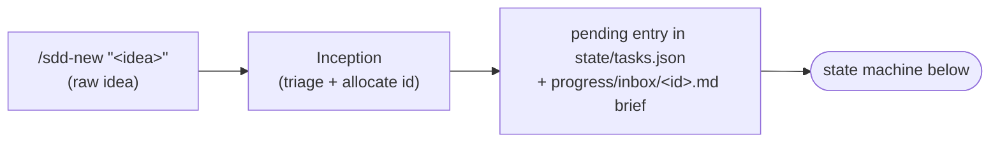
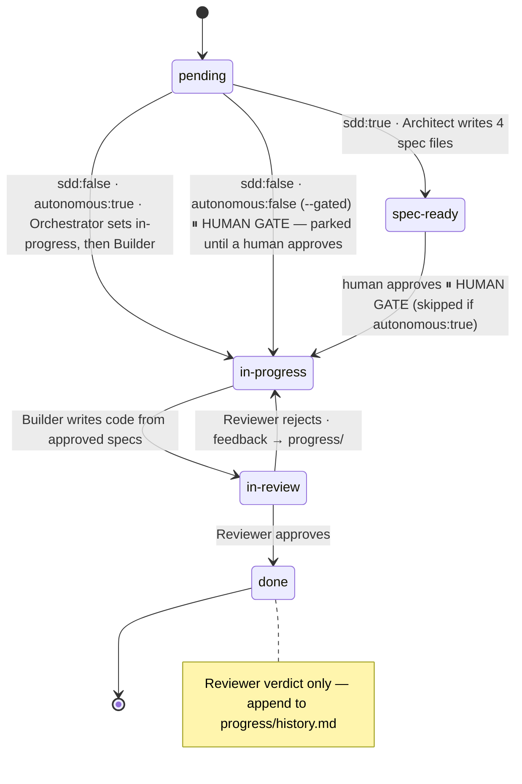

# The Workflow

## Intake — the step before `pending` (`/sdd-new`)

Before a feature is `pending`, a raw idea has to become a well-formed TaskStore
entry. That is **Inception**'s job (`agents/inception.md`), driven by the `/sdd-new`
slash command. A human runs `/sdd-new "<idea>"`, answers a short adaptive Q&A, and
Inception seeds the state machine below:



Inception **seeds; it never specs** — it writes only a `pending` entry plus the
intent brief, never the four spec files, and never advances status past `pending`.
From there `/sdd-next` (the Orchestrator) drives the flow below, including the human
gate. Inception does not spawn the Architect — but the brief is not inert: when the
Orchestrator spawns the Architect for that feature, it passes
`progress/inbox/<feature-id>.md` as a primary input, and the Architect reads it
first and specs from it. That read is what wires the captured intent into spec
generation.

### Deterministic selection with a portable fallback

`/sdd-next` normally asks the read-only, zero-dependency Node selector
`tools/next-task.mjs` for one schema-version-1 JSON decision. Bare selection,
`--mine`, and an exact feature target map respectively to no scope flag,
`--mine`, and `--feature E##-F##`. A valid result is authoritative: the
Orchestrator follows its route or reports its blocked/complete/halted outcome
without independently choosing different work.

Node remains optional. If it is unavailable, the selector fails, stdout is
invalid JSON, or the schema version is unsupported, the Orchestrator reports the
condition and uses the complete Markdown routing table retained in
`agents/orchestrator.md` as the behavioral oracle. Both paths preserve the same
epic, dependency, approval, ownership, slice merge, and rollup policy; only the
Orchestrator performs state writes.

## Whole-project inception (`/sdd-plan`)

Where `/sdd-new` triages **one idea**, `/sdd-plan` captures the **whole project** up
front. It is the **Planner** (`agents/planner.md`), a producer that sits **upstream** of
both the per-epic `/sdd-drill` (F03) and the `/sdd-next` loop. A human runs
`/sdd-plan "<idea>"`, answers a short adaptive Q&A, and the Planner writes the durable
design artifacts — `specs/vision.md`, `specs/architecture.md` + ADRs at
`specs/adr/NNNN-*.md` — and seeds a block of `draft` epics (`state/tasks.json` rows with
`features: []` + a one-paragraph `epic.md` each).

The Planner is a **producer that never specs**: it writes no feature
`.spec/.plan/.tasks/.tests`, never spawns the Architect, and **never advances an epic
past `draft`**. Seeded `draft` epics are inert — the F01 `next()` gate already keeps the
Orchestrator from selecting their features. The flow reads `/sdd-plan` (sketch the
roadmap) → `/sdd-drill <epic-id>` (deepen one epic, flip `draft → planned`) → `/sdd-next`
(execute). It is purely additive: a repo that never runs `/sdd-plan` behaves exactly as
before.

## Per-epic drill-down (`/sdd-drill`)

Where `/sdd-plan` sketches the **whole roadmap** as `draft` epics, `/sdd-drill` deepens
**one** of them. It is the **Driller** (`agents/driller.md`), a consumer that sits between
`/sdd-plan` and the `/sdd-next` loop. A human runs `/sdd-drill <epic-id>` on a single
`draft` epic; the Driller decomposes it into a list of `pending` feature entries (ids,
one-line intents, `depends_on`), fills the epic's `epic.md` feature table, writes a
per-feature inbox brief, and appends any per-epic **ADR deltas** the decomposition forces.

The drill ends in **exactly one** human decision at the epic granularity:

- **approve** → flip the epic `draft → planned` and stamp `autonomous: true` on every
  seeded feature, so the loop runs end-to-end with no per-feature gate;
- **keep gated** → flip the epic `draft → planned` while leaving every feature
  `autonomous: false`, so each parks at the normal per-feature spec-approval gate.

`/sdd-drill` is the **only step that flips an epic `draft → planned`** (the Planner never
advances past `draft`). It **decomposes, never specs** — it **never writes feature specs**
(no feature `.spec/.plan/.tasks/.tests`) and never spawns the Architect; the Architect
specs each feature just-in-time during the run. The flow reads `/sdd-plan` (sketch) →
`/sdd-drill <epic-id>` (deepen one epic) → `/sdd-next` (execute). It is purely additive: a
repo that never runs `/sdd-drill` behaves exactly as before.

## Change-size discipline (`change_size:`)

How large a feature is allowed to be is decided at **drill time** — the Architect specs what
it is handed, the Builder builds the spec, and the reviewer reads whatever diff comes out.
Nothing downstream revisits that decision, so the harness makes it explicit where it is made.

The `change_size:` block in `harness.config.yaml` is **advisory in two tiers**.
Neither tier blocks anything; each produces a *recorded decision*:

| tier | default | what it asks for |
|---|---|---|
| **advise** | `advise_lines: 1500` production lines, or `advise_files: 25` | split, or record one line saying why not |
| **escalate** | `escalate_lines: 3000` production lines, or `escalate_files: 50` | a recorded split plan, or an explicit override naming the reason |
| **drill-time proxy** | `max_requirements: 12` `R-id`s in one feature spec | split at decomposition, before any spec exists |

An absent `change_size:` block behaves exactly as those defaults.

**Why not a hard cap.** A single wall is the wrong instrument twice over: an agent-written
change is legitimately denser than a hand-written one, and a rename sweep, a generated
contract or a vendored file can be thousands of lines at near-zero review risk per line.
Review risk concentrates rather than spreading — in the case that motivated this rule, 10% of
the files carried 67% of the findings — so the budget prompts a *split along seams*, not a
refusal.

**Why production lines.** Tests are a deliberate quality choice the Reviewer already enforces
(a passing test per `R-id`); budgeting total lines would penalise exactly the discipline the
harness asks for. Budget the production number and let tests scale off it.

**Why requirement count at drill time.** It is the only size signal that exists before any
code does, and each `R-id` obliges a test — so the count *is* the size of the eventual diff.

**Who reads what.** The Driller reads `max_requirements` and splits an over-budget candidate
into siblings sequenced on `depends_on`, recording the decision in the epic's `epic.md`. The
Architect reads the same key and stops before writing the four spec files if the feature would
exceed it, reporting the count and the seams instead — or, where a human directs it to proceed,
writing an explicit override line into the `.spec.md`. Neither role emits a `blocked` record on
size: `blocked` is a closed vocabulary about dependencies and ownership.

### The pre-PR check (`tools/change-size.sh`)

The line and file budgets govern a *measured diff*, which does not exist at decomposition
time. They are consumed at the **Reviewer → PR handoff** — the last moment splitting is still
cheap, because a PR once opened carries review threads, a review history, and a `depends_on`
edge someone is waiting on.

```sh
sh "$HARNESS_DIR/tools/change-size.sh" --base origin/main [--format text|json]
```

It measures the diff from the **merge base** (the branch may be rebased or carry merges; only
the merge base is what a reviewer actually reads), classifies every changed file, and reports
the tier plus — when over budget — the production files carrying the most additions. That last
part is the point: the actionable question at the handoff is *where do I cut*, not *how big is
it*, and a bare total is equally true of the 15,500 low-risk lines and the 1,716 dangerous ones.

**It never blocks.** Exit 0 at every tier, including `escalate`. The only non-zero exit is `4`
— not a git repo, no resolvable base ref, bad flag — and that measures nothing. A tool that
could fail a branch for being large would be a hard cap wearing an advisory label, and the
first response to it would be to stop running it.

Classification is additive and configurable: `change_size.test_paths` and
`change_size.generated_paths` take extended regexes that are **added** to the built-in
multi-ecosystem defaults, never substituted for them. Get this wrong and the number is not
slightly off, it is meaningless — so extend the classifier rather than letting a repo's tests
count as production.

The Reviewer runs it before approving and records the tier and the decision in its verdict;
the Orchestrator runs it before opening the PR and carries the tier into the PR body.

## Architecture-aligned specs (the Architect cites ADRs)

The planning tier produces durable design artifacts; this contract makes them
**consumed**. `/sdd-plan` (the Planner) writes `specs/architecture.md` + the ADRs at
`specs/adr/NNNN-*.md`, and `/sdd-drill` (the Driller) records, in each feature's inbox
brief, the `ADR-NNNN` ids that feature is expected to honor. The **Architect**
(`agents/architect.md`) closes the loop: when those artifacts are present it reads
`specs/architecture.md` + the ADRs as a **mandatory input** alongside the brief, and every
feature `.spec.md` it writes carries a **`## Architecture alignment`** section citing the
`ADR-NNNN` ids the feature touches (seeded from the brief's recorded ids — the F03-D7
hook), each with a one-line "how this honors it".

- When architecture artifacts exist but the feature touches **no** recorded decision, the
  section records the explicit **`ADRs touched: none`** (a legitimate state, not a silent
  omission). A divergence is **stated in the section** (which ADR, how, why); the Architect
  never authors an ADR delta — that stays the Driller's job.
- **Graceful degradation:** in a repo that never ran `/sdd-plan` (or `/sdd-new`'s
  altitude-3 flow) the architecture is **absent** (a bare/template-stub file counts as
  absent), so the section is **not required** — the Architect records the absence and
  proceeds from the brief, fabricating no citation and never failing. Specs written before
  this contract stay valid (no retro-fit).
- The **Reviewer** confirms the section is present (citing ≥1 ADR or stating
  `ADRs touched: none`) **only where** architecture artifacts exist **and** the spec is
  `sdd: true` — and that each cited `ADR-NNNN` **resolves to an existing ADR file**: a
  **qualified** `<ns>/ADR-NNNN` against `specs/<ns>/adr/NNNN-*.md` **only** (`platform` =
  `specs/adr/`), a **bare** `ADR-NNNN` against **any** `adr/` namespace under `specs/`.
  A missing section there — like a cited-but-nonexistent
  (dangling) id — is a **soft flag** (not a hard reject), and the check never fires for
  a legacy/no-architecture feature or an `sdd: false` brief-only item. `init.sh` also
  runs a **warn-only sweep** of the same resolution check at session start, surfacing a
  dangling citation early without ever blocking the gate.

This places the citation contract **between** `/sdd-plan`/`/sdd-drill` (the producers) and
the Builder/Reviewer (the consumers) — it is additive and distinct from the `/sdd-plan`,
`/sdd-drill`, and `/sdd-fix` lanes.

## Doc-critic checkpoints

The **Doc-critic** (`agents/doc-critic.md`) is an automated, advisory review pass that
runs at three defined checkpoints in the planning tier. It reviews harness-generated
documents and specs, flags only issues that would cause real downstream problems
(completeness, consistency, clarity, scope, YAGNI), and lets the generating agent fix
them inline before proceeding. It is **advisory only** and never blocks or introduces a
human gate.

| Checkpoint | Caller | `target-type` | What is reviewed |
|---|---|---|---|
| After `/sdd-plan` | Planner | `plan-output` | `specs/vision.md`, `specs/architecture.md`, ADRs at `specs/adr/NNNN-*.md`, and every seeded `specs/epics/<id>-<slug>/epic.md` |
| After `/sdd-drill` | Driller | `epic-decomposition` | The target `epic.md`, its feature table, per-feature inbox briefs under `progress/inbox/`, and any ADR deltas appended by the drill |
| Before `spec-ready` | Architect | `feature-spec` | The four files for one feature: `.spec.md`, `.plan.md`, `.tasks.md`, `.tests.md` |

The generating agent spawns the critic as a sub-agent with the `target-type` and the
paths just written, applies any advisory findings **inline**, and proceeds. If the critic
errors or times out, the agent proceeds **best-effort** and appends a short note to
`progress/<run>/` so the skipped pass is auditable. The critic reviews **documents only**;
production-code review remains the Reviewer's job (E05).

## Drift check on epic rollup

Rolling-wave planning has a failure mode: a plan sketched early goes **stale** as you learn.
When an epic completes, the new ADRs and architecture deltas its implementation produced can
invalidate the briefs behind the epics still waiting in `draft`/`planned`/`pending`. The drift
check closes that loop, and it is **distinct from** the `/sdd-plan`, `/sdd-drill`,
architecture-alignment, and `/sdd-fix` lanes above.

- **When it fires:** **only** when an epic **rolls up to `done`** (all its features are `done`,
  so the Orchestrator derives+persists the epic's `done`). It does not run on every loop or on a
  feature `done` that does not complete its epic.
- **Scout flags.** The Orchestrator spawns the **read-only Scout** in a drift-check mode to
  re-validate the remaining `draft`/`planned`/`pending` epics against the just-completed epic's
  artifacts. The Scout writes a per-epic still-valid/stale findings file to `progress/` and makes
  **no** state change.
- **Orchestrator demotes.** The **Orchestrator** (not the Scout) demotes a stale
  `planned`/`pending` epic to **`draft`** and re-validates. A stale `draft` epic stays `draft`
  but is flagged; an `in-progress`/`done` epic is **never** demoted.
- **Backward only + manual re-drill.** Demotion only ever moves an epic **backward**
  (`planned`/`pending` → `draft`) — it never advances one. Bringing a demoted epic back to
  `planned` stays a **manual** `/sdd-drill <epic>` step; the Orchestrator reports that re-drill
  pointer on every demotion.
- **No-op, never silent.** With no remaining planning-tier epics, or no architecture to
  re-validate against, the check emits a clear "nothing to re-validate" note and changes nothing.

## Epic lifecycle

Epics have their own, simpler lifecycle: `draft → planned → in-progress → done`.

- **`draft`** — an inception sketch **anchored by a one-paragraph business brief** and
  carrying the **drillable-minimum five elements** (business brief; epic-level success
  criteria; technical considerations / restrictions / non-goals; cross-epic dependencies
  and boundaries; pointers to relevant shared ADRs), but **not yet drilled into
  features** — no feature specs, no `F01`, no EARS acceptance criteria, no detailed
  technical plan (see `agents/planner.md`). The Orchestrator **never selects work from a
  `draft` epic** — its features are not actionable, no matter what the feature itself
  says (`autonomous: true` skips the human approval gate, not this planning gate).
- **`planned`** — drilled down and human-approved; its features follow the feature
  state machine below, exactly as features of a `pending` epic do.
- Epic-level **`pending` is a legacy alias of `planned`** — gating-equivalent and
  kept indefinitely for backward compatibility. New docs use `planned`.

## State machine

A feature moves through these states. The Orchestrator routes on the current state;
the human gate sits between `spec-ready` and `in-progress`.



## Ownership & scoped selection (`owner` + `/sdd-next --mine`)

The TaskStore carries an **optional** `owner` field so a team sharing one install can
scope work to a person without racing on `state/tasks.json`. It is **additive and
backward-compatible**: with **no `owner` anywhere** and no `workflow.identity`, behavior
is **exactly today's** — board-wide selection that ignores `owner`. No migration is
needed; existing owner-free stores keep validating unchanged.

- **Two levels, feature wins.** `owner` (a string) may be set on an **epic** and/or on a
  **feature**. A feature's **effective owner** is its own `owner` when set, otherwise its
  parent epic's `owner`, otherwise **unowned**.
- **Identity.** The current developer's identity is `workflow.identity` in
  `harness.config.yaml`. Empty (default) ⇒ solo/board-wide. `"@me"` or `"self"` resolves
  **dynamically** to the authed `gh` user login (`gh api user`), so a **shared** config
  reflects whoever runs `/sdd-next` (the board-mirror `assignee` pattern). Any other value
  is a **literal** identity string. Comparison is literal — no alias/fuzzy matching.
- **Scoped selection.** `/sdd-next --mine` considers **only** features whose effective
  owner equals the resolved identity, selecting the first that is otherwise actionable.
  Scoping is applied **after** every existing `next()` gate (epic gate, `depends_on`-done,
  actionable status, human gate) — it **never relaxes** a gate. An owned feature that is
  not otherwise actionable is still skipped.
- **Owned-only, no claim (F01 boundary).** Scoped mode **never** selects an unowned
  feature and **never writes or claims** an `owner`. Claiming unassigned work, mode
  detection, and reassign UX are **E10-F02**.
- **Fail closed, never widen.** If `--mine` is requested but the identity is unresolved
  (`workflow.identity` empty, or a `@me`/`self` lookup fails), or if no owned actionable
  feature exists, `/sdd-next` selects nothing, reports why, and changes **no** state — it
  does **not** silently widen to board-wide selection.
- **Mirror stays one-way.** `state/tasks.json` is the single source of truth for `owner`;
  no agent reads the board to learn ownership.

## Diagnosing blocked selection

Dependency cycles and an empty `/sdd-next` result are planning diagnostics, not
environment failures. After the local TaskStore passes structural validation,
`init.sh` reports one deterministic warning per cyclic feature or slice component:

```text
⚠️  TaskStore dependency-cycle [feature]: E2-F1 -> E2-F2 -> E2-F1 (warn-only)
```

The full closed path is a repair witness. Feature and slice graphs are separate;
missing or cross-kind dependencies are blockers but are not invented as cycle
nodes. Warnings are **warn-only**: they do not change state or make an otherwise
healthy initialization fail.

When selection finds no task, the Orchestrator names each blocked candidate and
gate with stable reason codes:

```text
blocked E2-F1 [dependency-cycle]: dependency cycle (feature): E2-F1 -> E2-F2 -> E2-F1
blocked E2-F1 [unmet-dependency]: blocking dependencies: E2-F2=pending
no actionable work: selection blocked; see reasons above
```

Other reasons distinguish a draft parent (`gated-epic`), human approval
(`human-gate`), scoped ownership (`owner-excluded` / `owner-unresolved`), and a
truly empty or all-done board (`no-candidates`). This output is informational and
read-only. It explains the current selection policy; it does not relax a gate,
pick a fallback, or introduce a new TaskStore status.

## The human-in-the-loop gate

When `harness.config.yaml` has `require_spec_approval: true` (default), the
Orchestrator **pauses** at `spec-ready`. A human:

1. Reads the four spec files for the feature.
2. Requests changes if needed (the Architect revises; stays `spec-ready`).
3. Moves the feature to `in-progress` to authorize coding.

A task with `autonomous: true` in its frontmatter / TaskStore entry skips this gate
— use it only for low-risk work. The point of the gate is that you keep ownership
of *what the AI is building* before hours of code get written on a wrong premise.

## Selective SDD (the `sdd` flag)

Full SDD for a one-line tweak is overkill. Each task carries `sdd: true|false`:

- `sdd: true` → full flow: Architect → gate → Builder → Reviewer.
- `sdd: false` + `autonomous: true` → the Orchestrator **sets the feature to
  `in-progress`** (so the Builder's Loop A precondition holds), then sends the Builder
  straight at it, then Reviewer. No human pause.
- `sdd: false` + `autonomous: false` (e.g. `/sdd-fix --gated`) → **parked at the human
  gate**: the Orchestrator does **not** auto-run it. A human must approve it (move it to
  `in-progress`, or re-stamp `autonomous: true`) before the Builder runs.

### Lightweight fix lane (`/sdd-fix`)

For a one-line bug or hotfix, even seeding a full feature is overkill. `/sdd-fix
"<desc>"` (the **Fixer**, `agents/fixer.md`) is a thin front-end over the `sdd: false`
primitive: it seeds the fix as an `sdd: false` feature under a single **reserved
maintenance epic** (`E99`, `status: planned`, created on first use and reused by id
thereafter), carrying only a one-paragraph **inbox brief** at `progress/inbox/<id>.md` —
**no 4-file spec**, no drill. The fix is stamped `autonomous: true` by default, then handed
off **in-session** to the existing `sdd: false → Builder → Reviewer` path: the Orchestrator
sets it `in-progress` and the Builder runs it end-to-end. A `--gated` opt-out instead stamps
`autonomous: false`, which **parks the fix at the human gate** — the Orchestrator does not
auto-run it, so it waits until a human moves it to `in-progress` (or re-stamps it
`autonomous: true`). The lane **adds no new status and no new routing** — it reuses the
`sdd: false` primitive above (now split by `autonomous`); the Builder works from the inbox
brief and the Reviewer verifies the fix behaviourally.

### Bounded parallel fix lane (`/sdd-fix-parallel`)

The argument-free command consumes only ready autonomous `sdd:false` E99 fixes. It
orders numeric ids, selects at most `fix_lane.max_parallel` (default `3`), and reports
later ready candidates as cap-deferred. Every serial brief records
`## Files expected to change`; immutable guards cover `harness-install.sh`,
`tests/test_install.sh`, and `tools/*`, while `fix_lane.shared_paths` only extends the
guard. Missing, unsafe, or ambiguous metadata serializes fail-safe.

After native-concurrency/config preflight and a complete manifest, the coordinator
provisions each selected F02 worktree exactly once while the primary is clean. It then
switches the canonical primary to a collision-checked coordinator bookkeeping branch,
atomically claims the successful subset through F01 with canonical `HARNESS_DIR`, and
commits that shared claim before dispatch. All safe targeted workers start before any
is awaited; guarded fixes run exclusively in numeric order after that wave settles.

Each targeted worker keeps its pre-provisioned branch/worktree, drives clean
Builder↔Reviewer rounds, creates only the code PR after local approval, and runs
`/sdd-pr-loop` for that PR alone if it is installed (otherwise it drives that one PR's
review by hand). An observed code merge is reported to the coordinator;
the worker does not recreate or tear down F02 resources.

After all workers settle, the coordinator serializes history, performs one locked final
status reconciliation, and persists that truth through its bookkeeping PR. Once that
PR merge is observed, it fetches and fast-forwards the canonical local base, proves the
primary is clean/on the updated base/exact captured commit, and then tears down only
merged fixes with the original exact F02 identities. It never stashes, resets, cleans,
or force-deletes shared state. Recoverable failures preserve resources and do not
cancel siblings. No ready work is a zero-mutation success; missing native concurrency
or `execution.builder.backend: delegate` fails before manifest/provision/claim and
points to serial `/sdd-fix`.

## The PR review loop (`/sdd-pr-loop`)

After a feature's local gate is green and its PR is open, `/sdd-pr-loop <pr>` drives the
Codex review cycle to a terminal state. It is installed only while `pr_loop.enabled` is
`true`, and that gate is **opt-in**: a fresh install seeds `false`, so the command is
absent until someone turns it on — see
[INSTALL.md](INSTALL.md#sdd-pr-loop-opt-in-gated-on-pr_loopenabled) for the config block
and the `HARNESS_*` env knobs. Where it is **not** installed, drive the same cycle by
hand: request the review, apply the blocking findings, wait for merge.

**Preconditions.** The **Codex GitHub App** on the repository, an **authed `gh`**, and
**`jq`** on `PATH`. Step 0 of the loop runs `tools/wait-for-codex.sh preflight <pr>`,
which checks each one and **posts nothing**; a failure exits `5` with a one-line
diagnostic naming the failed check and its remedy, and the loop stops there. None of this
is an `init.sh` dependency.

**One round.**

1. **Preflight** — stop on any failure before posting.
2. **Trigger** — `gh pr comment <pr> --body "@codex review"`, taking the trigger comment
   id from the URL that command prints (`…#issuecomment-<id>`), never from a separate
   comment-list call: an unpaginated list returns only the first 30 (oldest) comments, so
   on a busy PR the lookup yields a stale id and silently disables the freshness filter.
3. **Watch** — launch `tools/wait-for-codex.sh <pr> <trigger-id> <round-dir>` **in the
   background** and branch on its exit code; never hand-poll. `0` findings · `3` clean ·
   `2` ceiling timeout (never "clean") · `4` usage/precondition · `5` no Codex activity
   inside `HARNESS_FIRST_RESPONSE` (the Codex GitHub App is probably not installed).
   The watcher writes `pr.json`, `review-comments.json`, `issue-comments.json`,
   `reactions.json` and `trigger-ts.txt` into the round dir on every poll — `gh pr view`
   alone returns neither the inline findings nor a banner past the first 100 comments.
   Codex signals *clean* three different ways (a review banner naming the head commit,
   that same banner as an issue comment, or a 👍 reaction on the trigger comment) and all
   three are load-bearing.
4. **Classify** — match `P0|P1|P2|nit` case-insensitively anywhere in the body (Codex tags
   severity as a shields.io **badge**, not bare text), first match wins, default `P2`,
   then filter to `blocking_severities`. Only **fresh** inline comments count: filed
   against `headRefOid` **and** `created_at >= trigger`, because GitHub re-stamps stale
   threads' `commit_id` onto each new head.
5. **Stall check** — a blocking comment id present in this round *and* the previous one
   escalates immediately, whatever the round number.
6. **Fix** — one `pr-fixer` sub-agent per blocking comment (one comment, one fix, one
   commit), then push. The `max_rounds - 1` round instead builds one combined prompt and
   escalates to a different worker, or runs one combined in-session pass. Reaching
   `max_rounds` labels the PR `needs-human` and stops.
7. **Gate re-check + terminal state** — with every gate green: if any unresolved review
   thread has a **non-Codex** participant, route to `needs-human`, resolve nothing and do
   not merge. Otherwise resolve the Codex-owned threads and, when `auto_merge` is true,
   merge with `merge_strategy` and `--delete-branch`; with `auto_merge` false, stop after
   the green summary. Local branch cleanup runs only if the merge command itself
   succeeded. A handover summary (rounds, worker totals, round-by-round, blocking
   comments resolved, cache path) is written to
   `<HARNESS_DIR>/.pr-loop/<pr>/handover-summary.md` and posted on **both** terminal
   states.

The per-round cache lives at `<HARNESS_DIR>/.pr-loop/<pr>/round-<n>/`, is gitignored, and
is best-effort — if it is missing or corrupt, reconstruct it from the `gh` API. Re-check
an existing round offline (no `gh`, no network) with
`sh tools/wait-for-codex.sh evaluate <round-dir>` — `0` findings, `3` clean, `1` pending.

## Context hygiene

Agents degrade as their context fills (noticeably past ~20%, badly past ~40%).
So:

- Each sub-agent runs with a **fresh, minimal context** — only the files it needs.
- Results go to `progress/<run>/` so the next agent resumes from files, not chat.
- When an agent nears `context_reset_threshold`, it should write a structured
  hand-off to `progress/` and let a fresh agent continue ("context reset").
- `progress/history.md` is the durable changelog across the whole project.

## One run, end to end (example)

1. `./init.sh` → green.
2. Orchestrator reads TaskStore → `E01-F01 example-feature` is `pending`, `sdd:true`.
3. Orchestrator spawns the Architect, passing `progress/inbox/E01-F01.md` (the
   Inception brief); the Architect reads it first and writes the 4 files from it →
   `spec-ready`. **Pause.**
4. Human reads specs, approves → `in-progress`.
5. Builder implements `tasks.md`, writes tests from `tests.md`, self-checks → `in-review`.
6. Reviewer runs tests + Playwright, verifies every R-id. On **reject** it writes
   file-based feedback to `progress/<run>/review.md` → `in-progress` → Builder
   addresses → re-review; this build↔review loop repeats until green. On **approve**
   → `done`. Each round is recorded in `progress/history.md`.
7. History updated. Orchestrator picks the next task.
